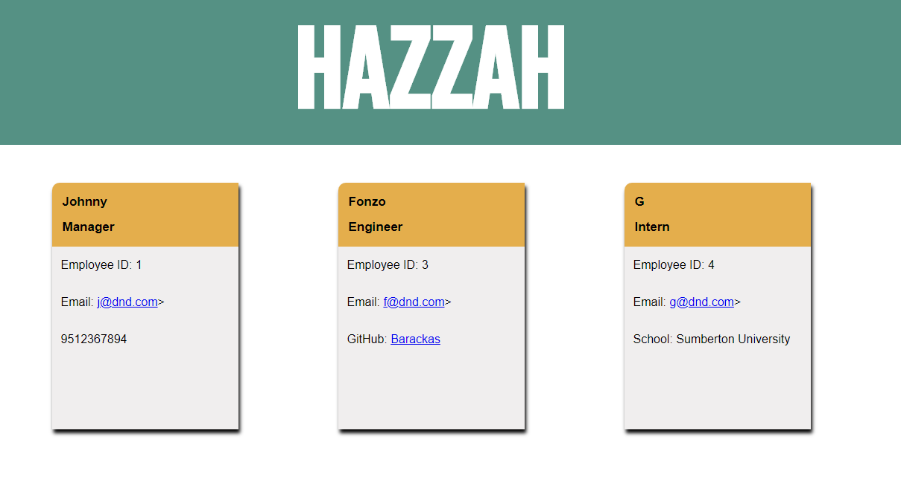
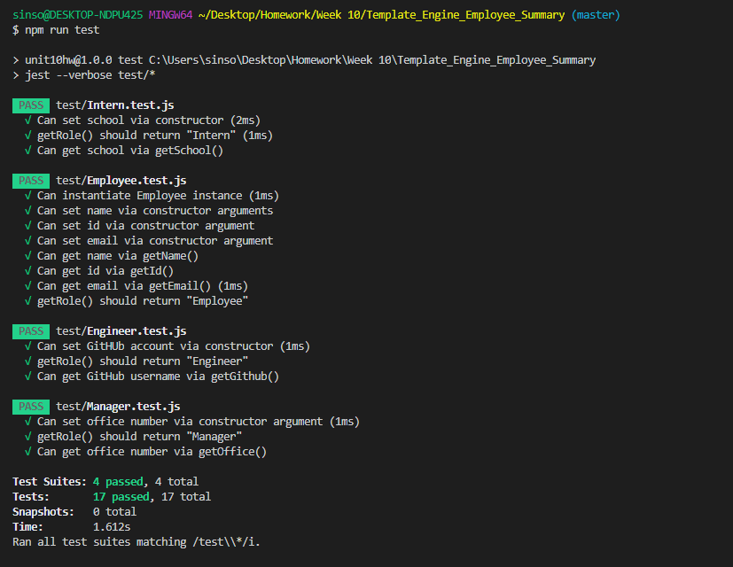

# Template_Engine_Employee_Summary

## Description

This application is to generate a webpage dynmaically through use input. Application uses node in order to display the user input onto a browser.

## Installation

Packages required: jest and inquirer
Run node app.js to see the application run.

## Images

Demon:

The generated HTML page:

## Testing

All testing was done prior to deployment. All files worked as intended and all tests passed.

